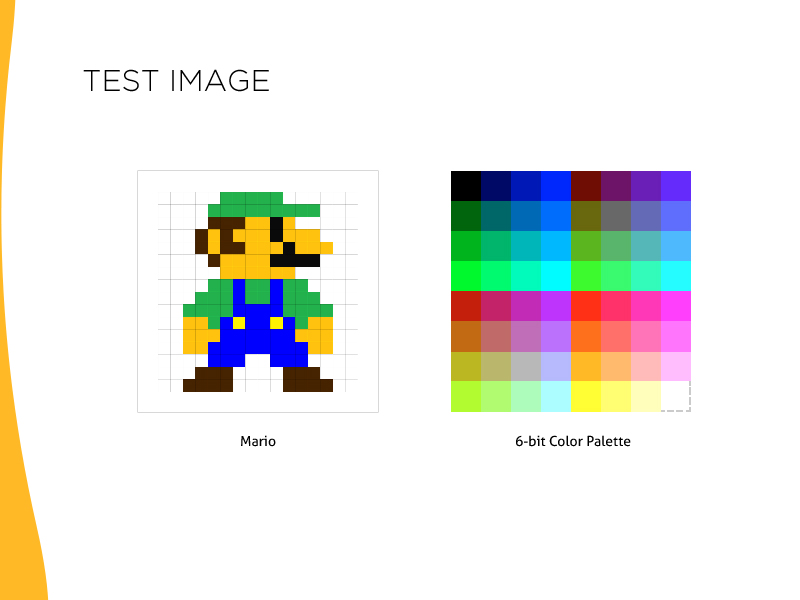
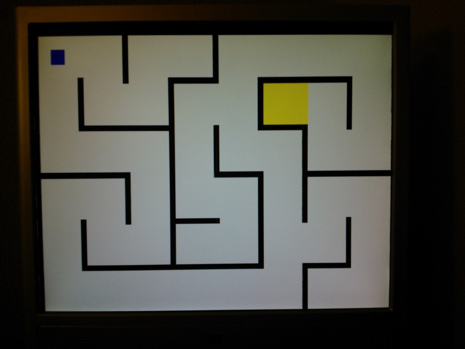

FPGA: Simple Maze Game using VGA for Graphics Output
====================================================

From: https://github.com/ThePedestrian/FPGA-Simple-Maze-Game-Using-VGA-Output

Overview
--------------------
+ Utilizes the Nexys™3 Spartan-6 FPGA Board
+ Uses the VGA for output.
+ Includes console application to convert an image into 8-bit ROM Verilog file that is 
   used by the synthesizer
+ Directional buttons on the FPGA are used for movement

Screenshots
------------------

How to use
----------------

+ Running ISE project:
  - Navigate to 'SRC/FPGA-Verilog-Code'
  - Double-click 'FinalProject2.xise' to launch
    project in ISE Project Navigator

+ Console app used to generate image ROM:
  - To open the files associated with the project,
    you will need Visual Studio. This project was
    built using Visual Studio 2012 but can be viewed
    and compiled with lower versions.
  - Navigate to 'SRC\VerilogFileGenerator\ConsoleApp'
    and double-click '417-ImageToHex' to launch the
    project.
  - The executable is located at:
    'SRC\VerilogFileGenerator\ConsoleApp\417-ImageToHex\bin'
    NOTE: If you compile in DEBUG mode, the executable
    will be in the 'debug' folder. Otherwise it will be saved
    to the 'release' folder.
  - **NOTE: Folder located at 'SRC\VerilogFileGenerator\SampleInput'
            contains sample input that is read by the console
			application.
