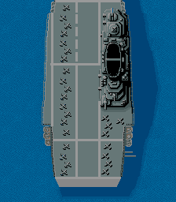
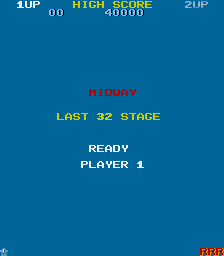
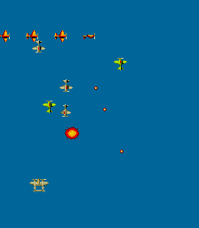
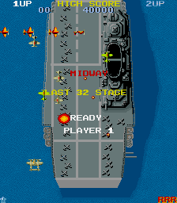

# 1942 FPGA arcade #

From: https://github.com/d18c7db/FPGA_1942

## About ##
This is an FPGA implementation of the arcade game "1942" based on the Capcom
schematic circuit diagram.

## Hardware ##
This has been implemeted on a custom FPGA board called the Pipistrello based on
a Spartan LX45 and designed by Saanlima.com (discontinued) but it should work
on any FPGA able to fit the design and all the game ROMs. Game controller
options are PS2 Keyboard or a Nintendo Gamecube Controller. Video output can be
via analog VGA and/or digital DVID directly to your monitor.

## Known Errors: ##
This current release is fully functional, without any known problems but it has
not had extensive testing.

During implementation, errors and omissions were discovered in the schematic.
For example in page `6/8` of the video schematic the ROMs `L1, L2, N1, N2`
don't have an `A13` address line listed but the reality is that `A13` is in
fact connected to signal `VOVER` on previous page.

I have also had to deviate from the schematic in one place to even have the
sprites display at all. This is also on page `6/8` of the video in the creation
of the `VINZONE` signal by the comparators `L5, M5` where I had to eliminate
gates `N4` and `M4` and simply feed the signal `A>B` inverted to gate `N5`.
I'm not totally sure why this is so and further investigation is needed. The
sprites however seem to function as they should, proven during both simulation,
debugging and actual game play.

## Description ##
The schematic consists of a total of 16 pages, the fist 8 pages cover the main
processor, audio board and character generation board `84100-01A` while the
last 8 pages cover the scroll generation, object generation and video mixing
board `84100-02A`. On the real arcade these are separate boards connected to
each other via ribbon cables.

The project has been split into functional modules which roughly correspond to
the relevant schematic pages.
- `FPGA_1942.vhd` is the arcade game top level module which connects all the
other modules together.
- `CPUA_IO.vhd` implements the main `CPU, ROM, RAM` and user `I/O` on pages
1 and 2 of `84100-01A`
- `CPUB_PSG.vhd` implements the audio CPU, ROM, RAM and PSG (programmable sound
generators) page 3 and 4 of `84100-01A`
- `SYNC.vhd` implements the synchronization signal generation on page 5 of
`84100-01A`
- `CHR_GEN.vhd` implements the character generation pages 6,7,8 of `84100-01A`
(this is video related but on main board)
- `SCR_GEN.vhd` implements scroll (background generation) pages 1,2,3 of
`84100-02A`
- `VIDEO_MIX.vhd` implements the video mixer on page 4 of `84100-02A`
- `OBJ_GEN.vhd` implements the object (sprite) generator on pages 5,6 of
`84100-02A`
- `OBJ_LINE_BUF.vhd` implements the sprite line buffer on page 7,8 of
`84100-02A`

## Debugging ##
Each video section can be easily debugged in the simulator by commenting out
unneccessary modules.

After making the relevant changes as below run the top level testbench in the
simulator for 20ms. At the end of the simulation in the `screens` folder, the
first frame of the video will be saved as a `.ppm` file (portable pixmap) which
can be viewed with a suitable graphics viewer.

### To debug the background (SCR): ###
1. in `FPGA_1942.vhd` comment out the modules `CPUA_IO, CPUB_PSG, CHAR_GEN,
OBJ_GEN, OBJ_LINE_BUF`
2. in `SCR_GEN.vhd` comment out the `RAM_A9` block.

The following picture will appear in the `screens` folder:

### To debug the text (CHR) ###
1. in `FPGA_1942.vhd` comment out the modules `CPUA_IO, CPUB_PSG, SCR_GEN,
OBJ_GEN, OBJ_LINE_BUF`
2. in `CHR_GEN.vhd` comment out the `RAM_D2` block.

The following picture will appear in the `screens` folder:

### To debug the sprites (OBJ) ###
1. in `FPGA_1942.vhd` comment out the modules `CPUA_IO, CPUB_PSG, CHAR_GEN,
SCR_GEN`
2. in `OBJ_GEN.vhd` comment out the `RAM_H9_H10` block.

The following picture will appear in the `screens` folder:

If all three modules are left in, then the composite picture looks like this:

The purpose of commenting out the RAM blocks is because during simulation an
equivalent debug ROM block is activated. ROM_A9, ROM_D2 and ROM_H9_H10 have been
prepared with suitable contents to simulate what the respective RAMs would have
been loaded with by the CPU had we not commented it out. This way we only have
to simulate the video circuitry for a short 20ms while it writes the first
video frame out, otherwise if we left all the game modules in, we would have to
simulate several seconds while the CPU wastes precious simulation time erasing
whole RAM sections and performing initialisation and other various tasks before
it even writes anything useful to the screen.
