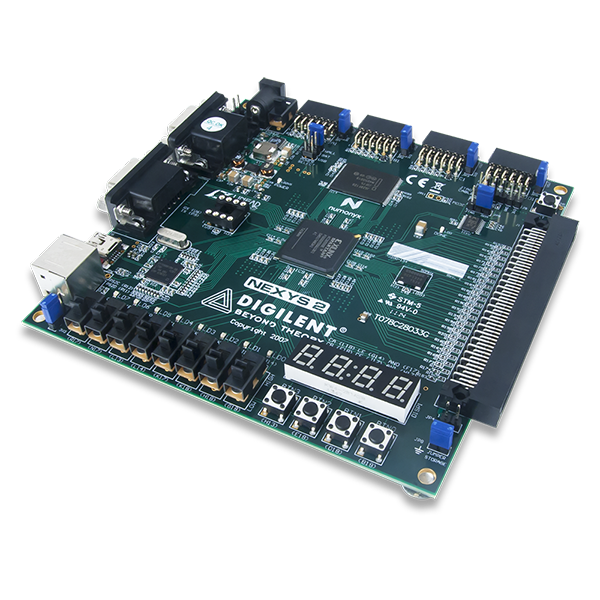

# FGPA Flappy Bird

Version: 1.0.0 
Original Release date:  27 March 2014 
Updated:  27 March 2014  

## What is this repository for?

This project implements the classic viral game Flappy Bird
in VHDL for use on a Spartan3E FPGA.  The FPGA will
connect to a VGA monitor, use the buttons and switches
as input, and allow the user to play the game while
keeping score on the seven segment display.

The board this game was designed for is the Nexys2:

## How do I run this thing?

This project requires no external hardware besides a VGA
monitor.  In order to run our project, simply download the
BIT file to the FPGA, hook up to a monitor, and begin playing!
The Controls are as follows:

-   Switches control the color of the Flappy Bird
-   Button 3 resets the game
-   Button 0 is equivalent to the "tap"
    Your current score will be shown on the right side of the
    Seven Segment Display, and the high score will be shown
    on the left side of the Seven Segment Display.

## I want some nitty-gritty details.

### Specifications:

There were several sections of work for this lab: bird color, bird movement,
environment graphics, column movement, and scoring.  We used two states in our
state machine: start and play.  Start would wait for the user to begin
"flapping" and play would loop until they crashed.

#### Flappy Bird:

We hard coded the pixel locations and colors for the bird.  You can change the
color of the bird by using the switches on the FPGA. We change and keep track
of the bird's y location with a register while the bird's x location remains
the same. The y location changes based on button presses and due to the bird
falling exponentially over time. When button 0 is pressed, we add a set value
to the bird's jump height.  After one delay period, we right shift in a zero
to this register(ex. 111 -> 011) and add that value to the height. This
continues until the jump register is full of zeros.  When the values of this
register are added to the current height, it causes the bird to "jump" smoothly.
Similarly, after the jump register is zero, we begin to left shift in a 1 to a
fall register (ex. 000 -> 001) and subtract this value from the bird's height.
This causes the bird to fall exponentially.  Eventually this register will be
completely filled with '1's and the bird will be falling at its maximum speed.

#### Columns:

We used three sets of signals to keep track of the columns.  Each column had
an x and y value.  The column would simply scroll left across the screen by
decrementing the x value.  We based the widths of the columns and the widths
of the gaps between columns on these x values. The column heights (placement
of the gaps) were based on a pseudo-randomly generated value.  We used a
makeshift LFSR based on values of the pixels and the current random number to
generate a new random number.  In order to keep the columns cycling
indefinitely, the transition from the 'start' state to the 'play' state
initializes the first column.  Then, each following column is activated once
the column preceeding it reaches a certain x value on the screen.  That is,
once column 1 reaches, say 450, it initializes column 2, and so on.

#### Scoring:

Our crash logic is simple. When the outline of the bird is drawn in the same
spot as a pipe or the ground then the bird "crashed". We increment the score
when the bird's left location goes past the right edge of each columns and
save the high score when the bird crashes. These scores are displayed on the
seven segment display with the high score on the left two digits, and the
current score on the right.

### Project Size:

-   Total Lines of VHDL Code: 415
-   Minimum Clock Period: 14.117 ns
-   Maximum combinational path delay: 4.937 ns
-   Number of Occupied Slices: 577
-   Number of VHDL Files: 4
-   Number of User Inputs: 10 (8 switches and 2 buttons)
-   Number of Outputs: 3 (LEDs, 7 segment display, VGA monitor)

### Build Options:

All of the delays are based off of the 50 MHz clock on the Spartan3E FPGA.
This code will not function at the correct speed if you use a different
clock rate.

## Future Work:

In the future, it would be great to enhance the graphics of
this game.  Currently, our graphics are very simple.  Other
ideas to implement would be interfacing with a keyboard for
input, and perhaps supporting a two-player or even 3 player
mode where multiple people can compete together.  We thought
of even adding a "cheat" to our game where if the bird was a
certain color it would ignore all collisions.

## Who do I talk to?

This display was originally created in the Winter of 2014 by:

-   Luke Hsiao
-   Steven Hammon
